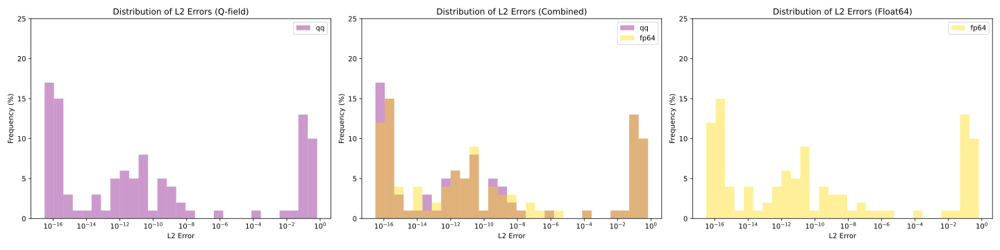
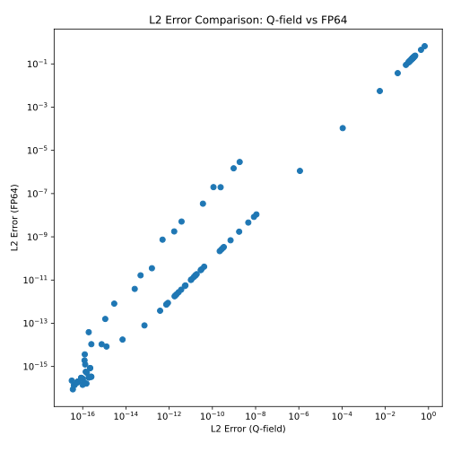
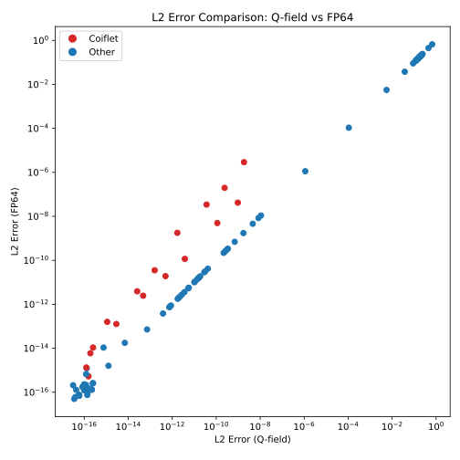

# Lifting Factorization of PyWavelets filter banks

**Andrii Kryvyi** @ *Ukrainian Catholic University*

**Correspondence:** kryvy.pn@ucu.edu.ua  <br/>
**Date**: March 2026

### Summary

We have successfuly factored PyWavelets `float64`-valued filter banks into lifting steps over $\mathbb{Q}$ field. We have used algorithm of Sweldens et al. with several modifications. This factorization was done by a fully automatized pipeline built on top of SageMath computer algebra system.

## 1. Notes

To keep this report simple we avoid describing concepts of laurent polynomials and 2x2 polyphase matrices.

## 2. Pipeline input and output

Our pipeline takes as an input a filter bank consisting of two deconstruction FIR filters with polyphase matrix $P$ s.t. $\det P \approx 1$. This condition is satisfied by all discrete wavelet filters from PyWavelets catalog.

On the output it generates two integer delay terms (even and odd) and a sequence of lifting steps of 5 types parametrized by polynomial $q$. In `JSON` file step is stored as follows:

**Q-field format**
```json
{
  "type": "predict",
  "shift": 0,
  "coefficients": [
    {
      "numerator": 1,
      "denominator": 1
    }
  ]
}
```

**FP64 format**
```json
{
  "type": "predict",
  "shift": 0,
  "coefficients": [
    1
  ]
}
```

So polynomial $q$ can be recovered as follows:

$$
q = \sum_{i=0}^{\text{len}(\text{coefficients}) - 1} z^{i + \text{shift}} \cdot \text{coefficients}[i]
$$

Those steps can be described as right-multiplication by a matrix $Q$ that depends on polynomial $q$:

- **Predict**: predict odd from even

$$
Q_i = \begin{bmatrix}1 & q_i \\
0 & 1\end{bmatrix}
$$

- **Update**: update even from odd

$$
Q_i = \begin{bmatrix}1 & 0 \\
q_i & 1\end{bmatrix}
$$

- **Scale Even**: scale even by a constant factor (note: $q$ is a zero-degree constant polynomial)

$$
Q_i = \begin{bmatrix}q & 0 \\
0 & 1\end{bmatrix}
$$

- **Scale Odd**: scale odd by a constant factor (note: $q$ is a zero-degree constant polynomial)

$$
Q_i = \begin{bmatrix}1 & 0 \\
0 & q\end{bmatrix}
$$

- **Swap**: swap even and odd (note: no dependency on q)

$$
Q_i = \begin{bmatrix}0 & 1 \\
1 & 0\end{bmatrix}
$$

Thus one-level wavelet transform can be represented by repeated vector-matrix multiplication with $s_e$ / $s_o$ being even/odd part transformed into Laurent polynomial and $a$ / $d$ approximation/details (low-frequency/high-frequency)

$$
\begin{bmatrix} a & d \end{bmatrix} = \begin{bmatrix} s_e & s_o \end{bmatrix} \prod_{i=1}^n Q_i
$$

And reconstruction given as:

$$
\begin{bmatrix} s_e & s_o \end{bmatrix} = \begin{bmatrix} a & d \end{bmatrix} \prod_{i=n}^1 Q_i^{-1}
$$

With $Q_i^{-1}$ being an inverse of $Q_i$ which is trivial to retrieve.

## 3. Factoring results

We have successfully factorized all 106/106 FIR filter banks present in PyWavelets catalog. We have measured L2 error between original polyphase matrix $P$ and resulting matrix $P'$:

$$
P' = \prod_{i=1}^nQ_i
$$

And L2 error measured as follows from the residuals matrix $R = P' - P$:

$$
L_2 = \sqrt{\|R_{11}\|^2_2+\|R_{12}\|^2_2+\|R_{21}\|^2_2+\|R_{22}\|^2_2} \\
$$

With L2-norm defined for Laurent polynomials as L2-norm over vector of coefficients.

We consider two $P'$ reconstructed matrices: first by multiplication in $\mathbb{Q}$ field, and second by multiplication after converting all coefficients to `float64`. The following error-rate of factorization was achieved:



<table>
  <thead>
    <tr>
      <th>Wavelet</th>
      <th>&#x211A;</th>
      <th><strong>FP64</strong></th>
      <th>Wavelet</th>
      <th>&#x211A;</th>
      <th><strong>FP64</strong></th>
      <th>Wavelet</th>
      <th>&#x211A;</th>
      <th><strong>FP64</strong></th>
    </tr>
  </thead>
  <tbody>
    <tr>
      <td>bior1.1</td>
      <td style='color: green'>5.75e-17</td>
      <td style='color: green'>1.92e-16</td>
      <td>bior1.3</td>
      <td style='color: green'>5.80e-17</td>
      <td style='color: green'>1.92e-16</td>
      <td>bior1.5</td>
      <td style='color: green'>5.84e-17</td>
      <td style='color: green'>1.94e-16</td>
    </tr>
    <tr>
      <td>bior2.2</td>
      <td style='color: green'>3.50e-17</td>
      <td style='color: green'>8.78e-17</td>
      <td>bior2.4</td>
      <td style='color: green'>4.28e-17</td>
      <td style='color: green'>1.42e-16</td>
      <td>bior2.6</td>
      <td style='color: green'>1.20e-16</td>
      <td style='color: green'>1.77e-16</td>
    </tr>
    <tr>
      <td>bior2.8</td>
      <td style='color: green'>1.13e-16</td>
      <td style='color: green'>1.80e-16</td>
      <td>bior3.1</td>
      <td style='color: green'>9.97e-17</td>
      <td style='color: green'>2.60e-16</td>
      <td>bior3.3</td>
      <td style='color: green'>8.47e-17</td>
      <td style='color: green'>2.98e-16</td>
    </tr>
    <tr>
      <td>bior3.5</td>
      <td style='color: green'>2.20e-16</td>
      <td style='color: green'>8.46e-16</td>
      <td>bior3.7</td>
      <td style='color: green'>1.91e-16</td>
      <td style='color: green'>3.10e-16</td>
      <td>bior3.9</td>
      <td style='color: green'>2.48e-16</td>
      <td style='color: green'>3.35e-16</td>
    </tr>
    <tr>
      <td>bior4.4</td>
      <td style='color: orange'>1.07e-11</td>
      <td style='color: orange'>1.07e-11</td>
      <td>bior5.5</td>
      <td style='color: orange'>1.01e-11</td>
      <td style='color: orange'>1.01e-11</td>
      <td>bior6.8</td>
      <td style='color: orange'>7.63e-13</td>
      <td style='color: orange'>7.63e-13</td>
    </tr>
    <tr>
      <td>coif1</td>
      <td style='color: green'>1.56e-16</td>
      <td style='color: green'>5.09e-16</td>
      <td>coif2</td>
      <td style='color: green'>1.25e-16</td>
      <td style='color: green'>3.64e-15</td>
      <td>coif3</td>
      <td style='color: green'>2.51e-16</td>
      <td style='color: orange'>1.08e-14</td>
    </tr>
    <tr>
      <td>coif4</td>
      <td style='color: green'>1.90e-16</td>
      <td style='color: orange'>3.88e-14</td>
      <td>coif5</td>
      <td style='color: green'>1.10e-15</td>
      <td style='color: orange'>1.58e-13</td>
      <td>coif6</td>
      <td style='color: green'>2.87e-15</td>
      <td style='color: orange'>8.12e-13</td>
    </tr>
    <tr>
      <td>coif7</td>
      <td style='color: orange'>2.55e-14</td>
      <td style='color: orange'>3.89e-12</td>
      <td>coif8</td>
      <td style='color: orange'>4.76e-14</td>
      <td style='color: orange'>1.65e-11</td>
      <td>coif9</td>
      <td style='color: orange'>1.59e-13</td>
      <td style='color: orange'>3.53e-11</td>
    </tr>
    <tr>
      <td>coif10</td>
      <td style='color: orange'>4.94e-13</td>
      <td style='color: orange'>7.40e-10</td>
      <td>coif11</td>
      <td style='color: orange'>1.71e-12</td>
      <td style='color: orange'>1.78e-09</td>
      <td>coif12</td>
      <td style='color: orange'>3.74e-12</td>
      <td style='color: orange'>5.09e-09</td>
    </tr>
    <tr>
      <td>coif13</td>
      <td style='color: orange'>3.65e-11</td>
      <td style='color: orange'>3.42e-08</td>
      <td>coif14</td>
      <td style='color: orange'>1.12e-10</td>
      <td style='color: red'>1.99e-07</td>
      <td>coif15</td>
      <td style='color: orange'>2.41e-10</td>
      <td style='color: red'>1.97e-07</td>
    </tr>
    <tr>
      <td>coif16</td>
      <td style='color: orange'>9.61e-10</td>
      <td style='color: red'>1.48e-06</td>
      <td>coif17</td>
      <td style='color: orange'>1.83e-09</td>
      <td style='color: red'>2.91e-06</td>
      <td>db1</td>
      <td style='color: green'>5.75e-17</td>
      <td style='color: green'>1.92e-16</td>
    </tr>
    <tr>
      <td>db2</td>
      <td style='color: green'>1.37e-16</td>
      <td style='color: green'>5.70e-16</td>
      <td>db3</td>
      <td style='color: green'>1.30e-16</td>
      <td style='color: green'>1.24e-15</td>
      <td>db4</td>
      <td style='color: green'>1.21e-16</td>
      <td style='color: green'>1.92e-15</td>
    </tr>
    <tr>
      <td>db5</td>
      <td style='color: green'>7.51e-16</td>
      <td style='color: orange'>1.07e-14</td>
      <td>db6</td>
      <td style='color: green'>1.26e-15</td>
      <td style='color: green'>8.40e-15</td>
      <td>db7</td>
      <td style='color: green'>6.98e-15</td>
      <td style='color: orange'>1.76e-14</td>
    </tr>
    <tr>
      <td>db8</td>
      <td style='color: orange'>7.19e-14</td>
      <td style='color: orange'>7.97e-14</td>
      <td>db9</td>
      <td style='color: orange'>3.60e-12</td>
      <td style='color: orange'>3.60e-12</td>
      <td>db10</td>
      <td style='color: orange'>1.37e-11</td>
      <td style='color: orange'>1.37e-11</td>
    </tr>
    <tr>
      <td>db11</td>
      <td style='color: orange'>3.37e-10</td>
      <td style='color: orange'>3.37e-10</td>
      <td>db12</td>
      <td style='color: orange'>1.73e-09</td>
      <td style='color: orange'>1.73e-09</td>
      <td>db13</td>
      <td style='color: red'>1.12e-06</td>
      <td style='color: red'>1.12e-06</td>
    </tr>
    <tr>
      <td>db14</td>
      <td style='color: red'>1.07e-04</td>
      <td style='color: red'>1.07e-04</td>
      <td>db15</td>
      <td style='color: red'>5.58e-03</td>
      <td style='color: red'>5.58e-03</td>
      <td>db16</td>
      <td style='color: red'>3.75e-02</td>
      <td style='color: red'>3.75e-02</td>
    </tr>
    <tr>
      <td>db17</td>
      <td style='color: red'>1.76e-01</td>
      <td style='color: red'>1.76e-01</td>
      <td>db18</td>
      <td style='color: red'>1.68e-01</td>
      <td style='color: red'>1.68e-01</td>
      <td>db19</td>
      <td style='color: red'>1.59e-01</td>
      <td style='color: red'>1.59e-01</td>
    </tr>
    <tr>
      <td>db20</td>
      <td style='color: red'>1.51e-01</td>
      <td style='color: red'>1.51e-01</td>
      <td>db21</td>
      <td style='color: red'>1.44e-01</td>
      <td style='color: red'>1.44e-01</td>
      <td>db22</td>
      <td style='color: red'>1.38e-01</td>
      <td style='color: red'>1.38e-01</td>
    </tr>
    <tr>
      <td>db23</td>
      <td style='color: red'>1.32e-01</td>
      <td style='color: red'>1.32e-01</td>
      <td>db24</td>
      <td style='color: red'>1.26e-01</td>
      <td style='color: red'>1.26e-01</td>
      <td>db25</td>
      <td style='color: red'>1.21e-01</td>
      <td style='color: red'>1.21e-01</td>
    </tr>
    <tr>
      <td>db26</td>
      <td style='color: red'>1.15e-01</td>
      <td style='color: red'>1.15e-01</td>
      <td>db27</td>
      <td style='color: red'>9.02e-02</td>
      <td style='color: red'>9.02e-02</td>
      <td>db28</td>
      <td style='color: red'>2.19e-01</td>
      <td style='color: red'>2.19e-01</td>
    </tr>
    <tr>
      <td>db29</td>
      <td style='color: red'>2.32e-01</td>
      <td style='color: red'>2.32e-01</td>
      <td>db30</td>
      <td style='color: red'>2.11e-01</td>
      <td style='color: red'>2.11e-01</td>
      <td>db31</td>
      <td style='color: red'>2.04e-01</td>
      <td style='color: red'>2.04e-01</td>
    </tr>
    <tr>
      <td>db32</td>
      <td style='color: red'>1.97e-01</td>
      <td style='color: red'>1.97e-01</td>
      <td>db33</td>
      <td style='color: red'>1.91e-01</td>
      <td style='color: red'>1.91e-01</td>
      <td>db34</td>
      <td style='color: red'>1.85e-01</td>
      <td style='color: red'>1.85e-01</td>
    </tr>
    <tr>
      <td>db35</td>
      <td style='color: red'>1.80e-01</td>
      <td style='color: red'>1.80e-01</td>
      <td>db36</td>
      <td style='color: red'>1.73e-01</td>
      <td style='color: red'>1.73e-01</td>
      <td>db37</td>
      <td style='color: red'>4.49e-01</td>
      <td style='color: red'>4.49e-01</td>
    </tr>
    <tr>
      <td>db38</td>
      <td style='color: red'>2.42e-01</td>
      <td style='color: red'>2.42e-01</td>
      <td>dmey</td>
      <td style='color: red'>6.64e-01</td>
      <td style='color: red'>6.64e-01</td>
      <td>haar</td>
      <td style='color: green'>5.75e-17</td>
      <td style='color: green'>1.92e-16</td>
    </tr>
    <tr>
      <td>rbio1.1</td>
      <td style='color: green'>5.75e-17</td>
      <td style='color: green'>1.92e-16</td>
      <td>rbio1.3</td>
      <td style='color: green'>5.80e-17</td>
      <td style='color: green'>1.92e-16</td>
      <td>rbio1.5</td>
      <td style='color: green'>5.84e-17</td>
      <td style='color: green'>1.94e-16</td>
    </tr>
    <tr>
      <td>rbio2.2</td>
      <td style='color: green'>3.11e-17</td>
      <td style='color: green'>2.22e-16</td>
      <td>rbio2.4</td>
      <td style='color: green'>3.90e-17</td>
      <td style='color: green'>1.36e-16</td>
      <td>rbio2.6</td>
      <td style='color: green'>9.92e-17</td>
      <td style='color: green'>1.42e-16</td>
    </tr>
    <tr>
      <td>rbio2.8</td>
      <td style='color: green'>1.49e-16</td>
      <td style='color: green'>1.62e-16</td>
      <td>rbio3.1</td>
      <td style='color: green'>9.97e-17</td>
      <td style='color: green'>2.73e-16</td>
      <td>rbio3.3</td>
      <td style='color: green'>8.47e-17</td>
      <td style='color: green'>2.98e-16</td>
    </tr>
    <tr>
      <td>rbio3.5</td>
      <td style='color: green'>2.20e-16</td>
      <td style='color: green'>8.46e-16</td>
      <td>rbio3.7</td>
      <td style='color: green'>1.91e-16</td>
      <td style='color: green'>3.10e-16</td>
      <td>rbio3.9</td>
      <td style='color: green'>2.48e-16</td>
      <td style='color: green'>3.35e-16</td>
    </tr>
    <tr>
      <td>rbio4.4</td>
      <td style='color: orange'>2.74e-12</td>
      <td style='color: orange'>2.74e-12</td>
      <td>rbio5.5</td>
      <td style='color: orange'>1.09e-08</td>
      <td style='color: orange'>1.09e-08</td>
      <td>rbio6.8</td>
      <td style='color: orange'>3.81e-13</td>
      <td style='color: orange'>3.81e-13</td>
    </tr>
    <tr>
      <td>sym2</td>
      <td style='color: orange'>8.77e-13</td>
      <td style='color: orange'>8.77e-13</td>
      <td>sym3</td>
      <td style='color: orange'>1.60e-11</td>
      <td style='color: orange'>1.60e-11</td>
      <td>sym4</td>
      <td style='color: orange'>1.95e-12</td>
      <td style='color: orange'>1.95e-12</td>
    </tr>
    <tr>
      <td>sym5</td>
      <td style='color: orange'>7.35e-13</td>
      <td style='color: orange'>7.35e-13</td>
      <td>sym6</td>
      <td style='color: orange'>5.32e-12</td>
      <td style='color: orange'>5.32e-12</td>
      <td>sym7</td>
      <td style='color: orange'>6.93e-10</td>
      <td style='color: orange'>6.93e-10</td>
    </tr>
    <tr>
      <td>sym8</td>
      <td style='color: orange'>3.10e-11</td>
      <td style='color: orange'>3.10e-11</td>
      <td>sym9</td>
      <td style='color: orange'>1.87e-11</td>
      <td style='color: orange'>1.87e-11</td>
      <td>sym10</td>
      <td style='color: orange'>5.66e-12</td>
      <td style='color: orange'>5.66e-12</td>
    </tr>
    <tr>
      <td>sym11</td>
      <td style='color: orange'>2.59e-10</td>
      <td style='color: orange'>2.59e-10</td>
      <td>sym12</td>
      <td style='color: orange'>2.20e-12</td>
      <td style='color: orange'>2.20e-12</td>
      <td>sym13</td>
      <td style='color: orange'>8.37e-09</td>
      <td style='color: orange'>8.37e-09</td>
    </tr>
    <tr>
      <td>sym14</td>
      <td style='color: orange'>1.78e-12</td>
      <td style='color: orange'>1.78e-12</td>
      <td>sym15</td>
      <td style='color: orange'>1.65e-11</td>
      <td style='color: orange'>1.65e-11</td>
      <td>sym16</td>
      <td style='color: orange'>2.87e-11</td>
      <td style='color: orange'>2.87e-11</td>
    </tr>
    <tr>
      <td>sym17</td>
      <td style='color: orange'>4.58e-09</td>
      <td style='color: orange'>4.58e-09</td>
      <td>sym18</td>
      <td style='color: orange'>2.18e-10</td>
      <td style='color: orange'>2.18e-10</td>
      <td>sym19</td>
      <td style='color: orange'>4.16e-11</td>
      <td style='color: orange'>4.16e-11</td>
    </tr>
    <tr>
      <td>sym20</td>
      <td style='color: orange'>3.05e-10</td>
      <td style='color: orange'>3.05e-10</td>
      <td></td>
      <td></td>
      <td></td>
      <td></td>
      <td></td>
      <td></td>
    </tr>
  </tbody>
</table>


The above table is colored as: `green` if $L_2 < 10^{-14}$, `yellow` if $L_2 < 10^{-7}$ and otherwise `red`.



We can see that FP64 error is highly correlated with Q-field error, thus we can conclude that factorization is stable in terms of recovering original polyphase matrix, because almost all error comes from projecting input matrix into space of matrices with determinant exactly *1*, but not from converting all coefficient to `float64`.



Only for coiflets the datatype matters and converting fractions to `float64` increases error rate by a constant factor.

## 4. Comparing numerical stability


